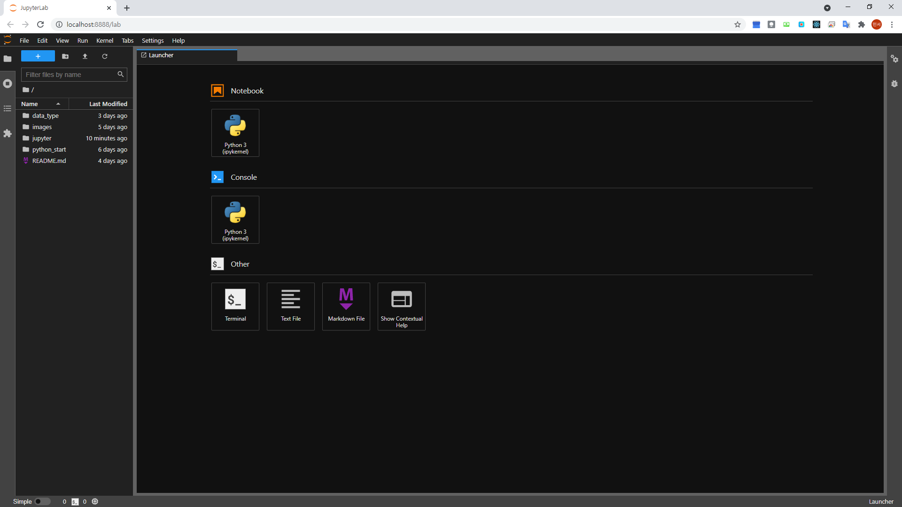

## 목차

- [Jupyter Notebook](#jupyter-notebook)
- [pip](#pip)
  - [패키지 설치 명령어](#패키지-설치-명령어)
  - [패키지 삭제 명령어](#패키지-삭제-명령어)
- [Jupyter 설치 및 실행](#jupyter-설치-및-실행)
  - [설치](#설치)
  - [실행](#실행)
- [Jupyter 사용 단축키](#jupyter-사용-단축키)
  - [셀 선택 모드 (Command Mode)](#셀-선택-모드-command-mode)
  - [코드 입력 모드 (Edit Mode)](#코드-입력-모드-edit-mode)


# Jupyter Notebook

- https://jupyterlab.readthedocs.io/en/stable/

주피터 노트북(Jupyter Notebook)은 웹 브라우저에서 파이썬 코드를 작성하고 실행해 볼 수 있는 개발도구이다.

일반적으로 아나콘다(Anaconda)를 설치하면 Jupyter Notebook이 함께 설치되어 Jupyter를 사용할 수 있다. 물론 Anaconda를 사용하지 않는 경우 pip 을 통해 Jupyter 패키지를 설치할 수도 있지만, 통상 Anaconda를 설치해서 사용할 것을 권장한다.

여기서는 pip를 통해 Jupyter 패키지 설치 방법을 알아본다.

# pip

pip는 파이썬(python)으로 작성된 패키지 소프트웨어를 설치 · 관리하는 패키지 관리 시스템이다. Python Package Index (PyPI)에서 많은 파이썬 패키지를 볼 수 있다.

## 패키지 설치 명령어

```bash
$ pip install [some-package-name]
```

## 패키지 삭제 명령어

```bash
$ pip uninstall [some-package-name]
```

# Jupyter 설치 및 실행

## 설치

```bash
$ pip install jupyterlab
```

## 실행

```bash
$ jupyter-lab
```

- 실행화면



# Jupyter 사용 단축키

## 셀 선택 모드 (Command Mode)

|단축키|설명|
|:---:|---|
|`a`|위로 셀 추가|
|`b`|아래로 셀 추가|
|`d` `d` (d를 두번 누름)|선택 셀 삭제|
|`x`|선택 셀 잘라내기 (삭제로 써도 무방)|
|`c`|선택 셀 복사하기 |
|p|선택 셀 아래에 붙여넣기|
|`shift`] + `m`|선택 셀과 아래 셀과 합치기|
|`o`|실행결과 열기/닫기|
|`m`|Markdown으로 변경|
|`y`|Code로 변경|
|`ctrl` + `s` 또는 `s`|파일 저장|
|`enter`|선택 셀의 코드 입력 모드로 돌아가기|
|`i` `i`|커널 중지 (i 두번 연타)|
|`0` `0`|커널 재시작 (숫자 0 두번 연타)|
|`Shift` + `L`|모든 셀 줄 번호 옵션 켜기/끄기|

## 코드 입력 모드 (Edit Mode)

|단축키|설명|
|:---:|---|
|`Ctrl` + `/`|커서 위치 라인 주석처리|
|`Shift` + `Ctrl` + `-`|커서 위치에서 셀 둘로 나누기|
|`Ctrl` + `D`|선택된 줄 삭제|
|`Shift` + `Enter`|선택 셀 코드 실행 후 다음 Cell로 이동 (없으면 새로 추가)|
|`Ctrl` + `Enter`|선택 셀 코드 실행|