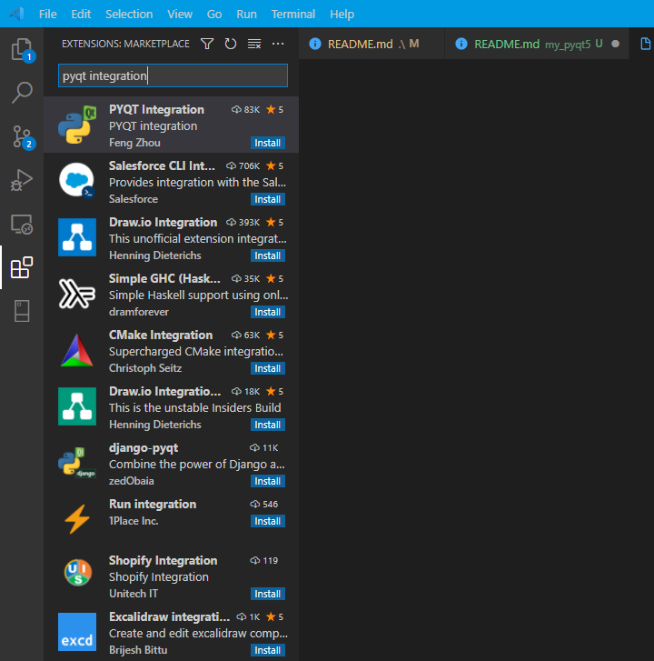
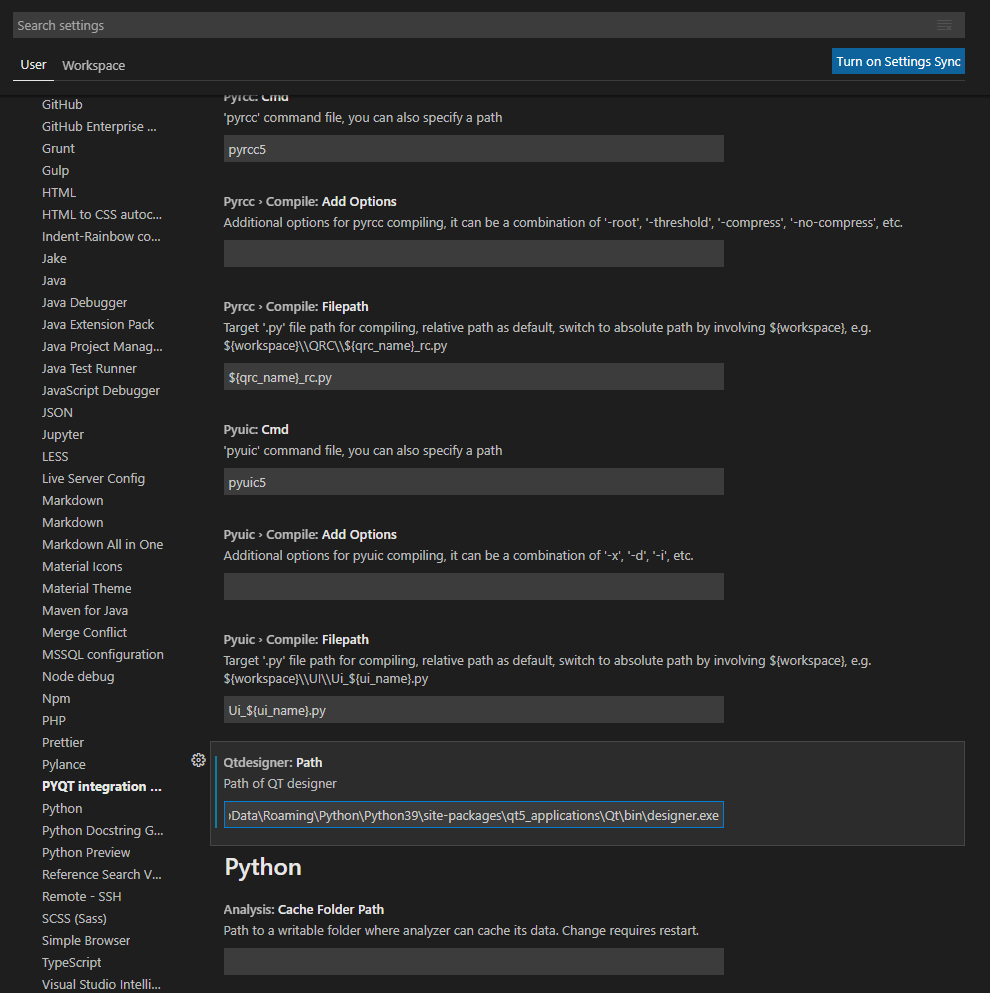
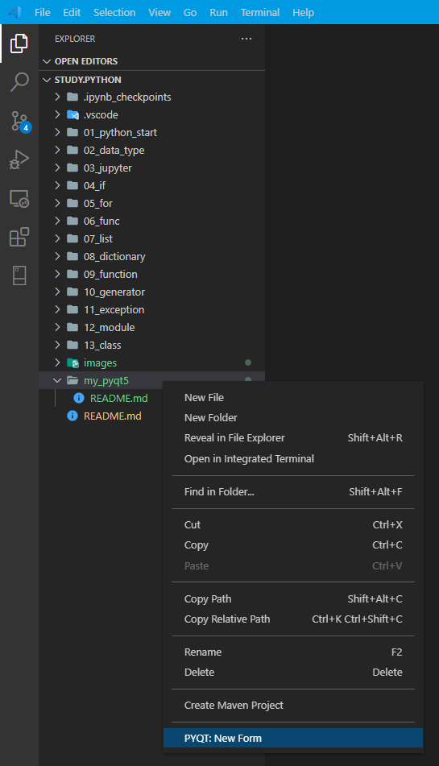

## 목차

- [PyQt5 사용하기](#pyqt5-사용하기)
  - [PyQt 설치](#pyqt-설치)
  - [Qt Designer 설치](#qt-designer-설치)
  - [Qt Designer 실행](#qt-designer-실행)
    - [Qt Designer와 VSCode 연동](#qt-designer와-vscode-연동)
- [파이썬 GUI 배포](#파이썬-gui-배포)

# PyQt5 사용하기

DOC: [https://www.riverbankcomputing.com/static/Docs/PyQt5/index.html](https://www.riverbankcomputing.com/static/Docs/PyQt5/index.html#)

PyQt는 The Qt Company의 Qt 애플리케이션 프레임워크를 위한 파이썬 바인딩의 집합이다.  
간단하게 파이썬을 사용하여 GUI 프로그래밍을 하기위한 패키지로 생각하면 된다.  
PyQt를 환경설정하는 방법은 여러가지가 있지만 여기서는 `pip` 명령어를 통해 패키지를 설치하는 방식으로 진행한다.

모든 GUI를 코드로 한줄한줄 입력해서 만들 수 있지만,  
나는 QT Desinger를 활용해서 GUI를 좀더 편하고 쉽게 만들어 보려고 한다.  
상황에 따라서 둘을 병행하면서 화면 GUI를 구성해야하지 않을까 싶다.

## PyQt 설치

```bash
$ pip install pyqt5
```

## Qt Designer 설치

```bash
$ pip install pyqt5-tools
```

## Qt Designer 실행

Qt Designer 실행 파일을 찾는데 좀 애먹었다.  
처음 파이썬 환경설정이 이상하게 됐는지 다른 블로그 글과 다른 경로에서 실행 파일을 찾았는데  
어차피 설치는 되었으니 최대한 근접한 경로로 찾아가서 실행 파일을 찾았고 도움되었던 블로그 글 링크를 아래에 첨부하겠다.

> [https://wonderbout.tistory.com/185](https://wonderbout.tistory.com/185)

나는 중간에 조금 다른 경로를 거쳐가긴 했지만 위의 블로그에서 제시해준 것과 동일하게 실행 파일을 찾을 수 있었다.  

`C:\Users\사용자\AppData\Roaming\Python\Python39\site-packages\qt5_applications\Qt\bin\designer.exe`

해당 desinger.exe 실행 파일을 바로가기 해놓거나 시작 화면에 추가해놓자.  
VSCode로 파이썬 개발을 한다면 위의 해당 블로그에서 제시해준 Qt 디자이너를 VSCode에 연동시키면 편하게 사용 가능하다.

### Qt Designer와 VSCode 연동

VS Code를 실행 후 `pyqt integration` 익스텐션을 설치한다.



해당 익스텐션 설치 후 Setting 화면으로 가서 (`File > Preferences > Settings` 또는 ` Ctrl + , `)  
`PyQt integration` 익스텐션으로 접근 후 `Qtdesigner:Path` 설정 부분에 `designer.exe` 실행파일 경로를 넣어준다. (아래 이미지 참고)



그리고 파일 탐색창 부분에서 마우스 우클릭 후 Qt 디자이너를 시용할 수 있는 메뉴들이 나온다.



(아직 하나의 메뉴 밖에 없지만 GUI 작업하다보면 작업 파일에 맞는 메뉴 더 생김)

# 파이썬 GUI 배포

[🏷 **Python GUI Build**](./build)