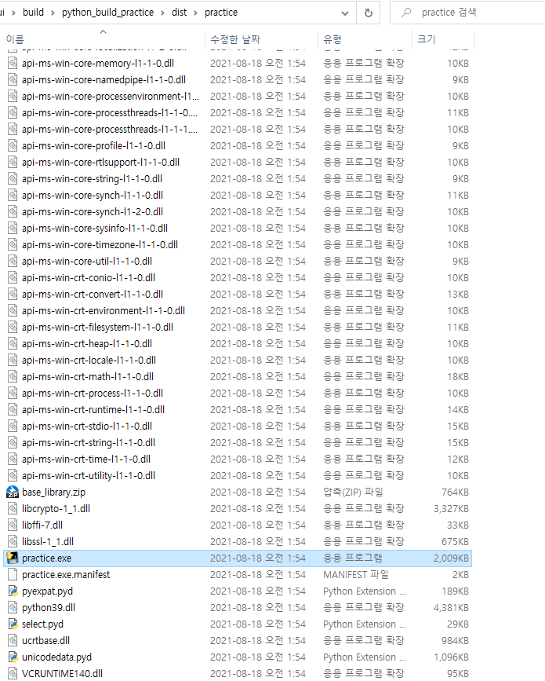

# ⚙ Build Python Programe

파이썬 프로그램 배포라는 주제로 파이썬 프로그램을 `.exe` 실행 파일로 만드는 방법을 알아보자.  
다른 OS환경에 Python이 설치되어 있지 않아도 `.exe` 실행 파일로 파이썬 프로그램을 실행 가능하게 하는 것이다.

## 1️⃣ pyinstaller 라이브러리 설치

파이썬 프로그램을 `.exe` 실행 파일로 변환시켜주는 패키지이다.

```bash
$ pip install pyinstaller
```

- 설치후 명령어 입력후 command not found 작동 오류가 발생한다면 아래의 글을 확인해주자.
  - [command not found](#패키지-커맨드-경로-오류시)


## 2️⃣ 간단한 커맨드 실행 파일 만들어보기

파이썬 파일을 예제로 커맨드 실행 파일을 만들어보자.

- 변환할 예제 파이썬 파일 작성

`./python_build_practice/practice.py`

```python
print('Pyinstaller 테스트')
```

- 터미널을 파이썬 파일 경로 위치에서 아래의 명령어 실행
```bash
# 상위 경로에 있다면 해당 파일까지의 하위경로를 포함시켜서 입력하면 된다.
$ pyinstaller practice.py
```


명령어 실행이 완료되면 해당 파일 위치에 위의 이미지처럼 새로운 것들이 생성됨을 볼 수 있다.  
`build`, `dist`, `.spec` 등 `.exe` 실행 파일 실행시 필요한 자원들이다.  
실행 파일 위치는 `dist` 디렉토리 하위에 생성되어 있다.



해당 실행 파일을 그냥 더블 클릭해서 실행하게 되면 터미널 콘솔창이 열리고 바로 닫히는 과정을 볼 수 있는데,  
이는 `practice.py` 에 작성되어 있는 print 함수가 빠르게 실행하고 프로그램이 완료되어 종료되면 콘솔창이 닫히게 되는건데  
너무 빨라서 우리 눈에는 그냥 열리고 바로 닫히는 것처럼 보인다.  

정상적으로 .exe 파일이 만들어진건지 정확히 확인하기 위해 해당 실행 파일을 터미널로 실행해 본다.


터미널로 해당 경로에 접근해서 실행 파일을 실행하면 위와 같은 정상적인 결과를 확인 할 수 있다.

## 3️⃣ pyinstaller 옵션

### `pyinstaller 파일.py`
- 실행시 필요한 모든 자원들이 같이 생성됨
- 실행시 터미널을 통해 실행되기 때문에 터미널 콘솔창이 먼저 뜸

### `pyinstaller -F 파일.py`

- `dist` 하위에 하나의 실행파일만을 생성됨
- 내부에 실행시 필요한 자원들이 압축되어있어 실행시 압축파일들을  
모두 임시경로에 풀어서 실행해야하기 때문에 속도가 더 느림
- 실행시 터미널을 통해 실행되기 때문에 터미널 콘솔창이 먼저 뜸

### `pyinstaller -w 파일.py`

- 실행시 필요한 모든 자원들이 같이 생성됨
- 실행시 window 환경으로 실행되기 때문에 터미널 콘솔창이 열리지 않음

### `pyinstaller --add-data '복사할파일;저장할위치' 파일.py`

- 이미지, 로고 또는 아이콘 등 실제 자원을 실제 코드상의 경로에 맞춰 변환해야하는 경우에 사용

### `pyinstaller --name '이름' 파일.py`

- `.exe` 파일 이름을 설정한다.

### 참고 영상

- [SilentTech : [Build GUI Application with PyQT and create exe file]](https://youtu.be/3CKYvLW5U7I)

## 4️⃣ Python GUI 실행 파일 만들기

예제 ( [Study.Python\my_pyside2\clone\splash_window.ui](../../my_pyside2/clone) )

```bash
$ pyinstaller -w --add-data './image/*.png;./image' --add-data './icons/*.png;./icons' splash_window.py
```

```bash
$ pyinstaller -w -F --add-data './image/*.png;./image' --add-data './icons/*.png;./icons' --name "myGUIApp" splash_window.py
```

### exe 파일 정상작동 확인 후

실행 파일이 정상적으로 작동하는 것을 확인 후 몇 가지 간단한 테스트를 해보았다.
- `-F` 로 변환하였을 시
  - `.exe` 파일 경로 변경 -> 정상작동
  - `build` 디렉토리 삭제 -> 정상작동
  - `.spec` 파일 삭제 -> 정상작동
- 즉, `.exe` 파일만 존재한다면 모두 정상작동함. (단, `-F`로 변환했을시에만)

### 💡 exe 파일 실행후 unhandled exception in script 발생시

이러한 오류는 코드를 실행하면 아무 문제 없이 정상 작동하지만 exe 파일로 변환 후 실행시 발생되는 오류다.  
해당 오류는 코드 상에 import 되어 있는 부분에서 발생되는 문제일 가능성이 매우 높다.  
그러니 작성된 코드를 재확인해서 필요하지 않는 부분까지도 import 해오고 있는 코드가 있는지 확인이 필요하다.  
나는 대부분의 import 코드가  

    from PySide2 import *
    from PySide2.QtCore import *
    ...

등등 중복되는 import 라던지 아직 `pyinstaller` 가 지원하지 않는 패키지 모듈까지 임포트 해오는 부분이 있어서  
필요한 패키지 모듈만 임포트 할 수 있게 코드 리팩토링 후 재배포를 반복하면서 오류를 해결했다.

## 패키지 커맨드 경로 오류시

### 💡 command not found

패키지 설치 후 커맨드 오류가 발생 할 경우가 있다.


나는 처음 파이썬 설치 경로를 잘못해서 그런건지 이 외의 다른 파이썬 패키지 커맨드 오류가 계속 발생해서 여러가지 시도를 해보았다.  
다른 OS 환경변수 설정해서 제대로 실행 가능했다는 스텍오버플로우 글도 찾아봤지만 나는 그냥 커맨드 실행 파일을 현재 파이썬 커맨드 위치로 옮겨서 해결했다.

일단 현재 실행하고자 하는 파이썬 패키지 커맨드 파일 위치를 찾아야 한다.


위의 이미지는 현재 내 `python.exe` 실행 파일이 있는 폴더에서 `Scripts` 폴더 내부의 실행 파일들의 모습이다.  

❗ **이 위치를 기억해두자** `C:\Program Files\Python39\Scripts\...`  

현재 내 OS 환경변수 설정은  
`C:\Program Files\Python39\Scripts\` 과  
`C:\Program Files\Python39\` 으로 되어있어서 `python`, `pip` 커맨드를 사용할 수 있었던 것이다.  
(이 디렉토리 경로는 사용자 마다 다른 경로에 위치 할 수 있다.)  
즉, 파이썬 패키지 커맨드 실행 파일을 이 위치로 옮겨오면 된다.


위의 이미지는 사용자 경로에 있는 `site-package` 와 같은 위치에 있는 `Scripts` 폴더 내부의 모습이다.  
자세히 보면 내가 방금 설치했고 찾으려고 했던 `pyinstaller` 커맨드 실행 파일을 발견할 수 있다.

`C:\Users\dlals\AppData\Roaming\Python\Python39\Scripts\...`  
(이 디렉토리 경로는 사용자 마다 다른 경로에 위치 할 수 있다.)

이제 이 패키지 커맨드 실행 파일을 옮겨와준다. (`ctrl+c` 복 -> `ctrl+v` 붙)

그리고 다시 터미널에 `pyinstaller --help` 명령어를 입력하게 되면 커맨드가 정상적으로 작동하는 것을 볼 수 있다.


