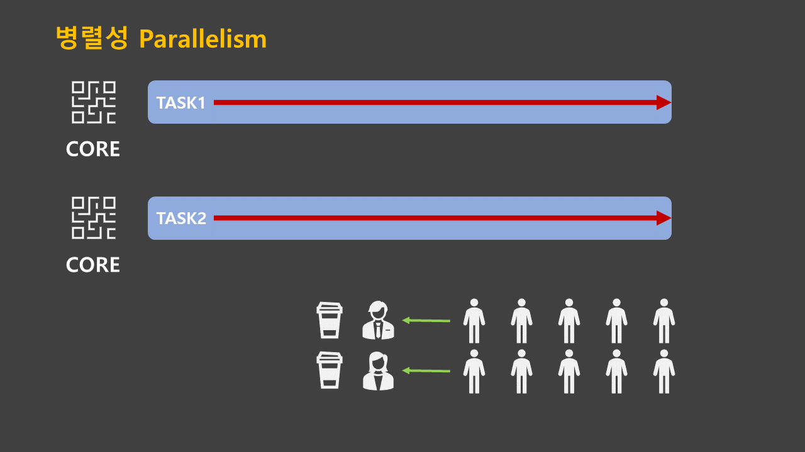
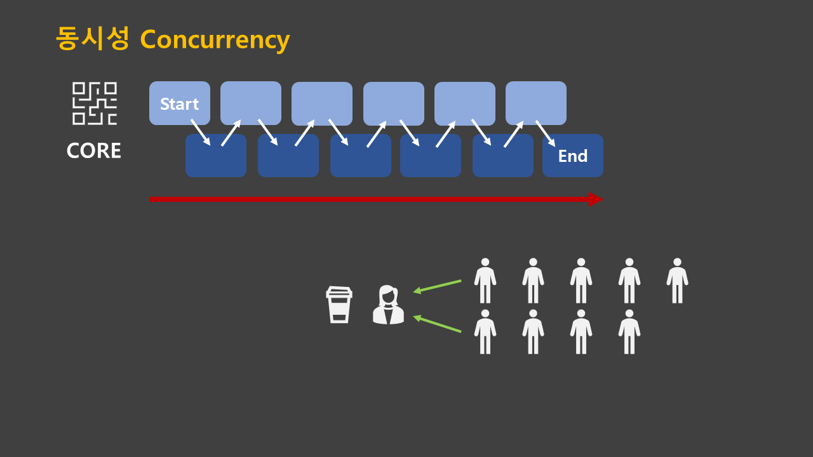

# asyncio 동시성 프로그래밍

asyncio(Asynchronous I/O)는 파이썬에서 제공하는 동시성 코드를 작성하는 표준 모듈이다.  
asyncio는 고성능 네트워크 및 웹 서버, 데이터베이스 연결 라이브러리, 분산 작업 큐 등을 제공하는 여러 파이썬 비동기 프레임워크의 기반으로 사용된다.

즉, 자바스크립트처럼 비동기로 작동하는 코드를 파이썬도 asyncio를 통해 작성이 가능하다!!

## 동시성 프로그래밍

동시성 프로그래밍의 <U>동시 처리</U>는 간혹 <U>병렬 처리</U>와 혼동할 수 있는데 그 이유는 동시 처리와 병렬 처리 모두 비동기 방식이며,  
실제로 실행 결과로만 보면 동시 처리 자체가 병렬 처리되는 것처럼 보이기 때문이다.   
그렇지만 사실 asyncio의 동시 처리 동작 원리를 보면 병렬 처리 방식과 완전히 다르다는 것을 알 수 있다.

|동시성|병렬성|
|---|---|
|동시에 실행되는 것 같아 보이는 것|실제로 동시에 여러 작업이 처리되는 것|
|싱글 코어에서 멀티 쓰레드를 동작 시키는 방식|멀티 코어에서 멀티 쓰레드를 동작시키는 방식|
|한번에 많은 것을 처리|한번에 많은 작업(일) 단위를 처리|
|논리적인 개념|물리적인 개념|

## 비동기 프로그래밍

웹 서버와 같은 애플리케이션을 생각해보면 CPU 연산 시간 대비 DB나 API와 연동 과정에서 발생하는 대기 시간이 훨씬 길다는 것을 알 수 있다.  
비동기 프로그래밍은 이러한 대기 시간을 낭비하지 않고 그 시간에 CPU가 다른 처리를 할 수 있도록 하는데 이를 흔히 non-blocking하다고 말한다.

자바스크립트와 같이 애초에 비동기 방식으로 동작하도록 설계된 언어에서는 익숙한 개념이지만,  
파이썬과 같이 기본적으로 동기 방식으로 동작하는 언어에서는 이 기념이 생소하게 느껴질 수도 있다.  
하지만 파이썬 3.4에서 asyncio가 표준 라이브러리로 추가되고, 파이썬 3.5에서 async/await 키워드가 문법으로 채택이 되면서,  
파이썬도 이제 언어 자체적으로 비동기 프로그래밍이 가능해 졌다.

> 참고 블로그: [DaleSeo 블로그: [파이썬] asyncio로 비동기 처리하기](https://www.daleseo.com/python-asyncio/)

## 더 알아보기

이번 예제들은 jupyter notebook을 사용하지 않음  
현재 jupyter notebook에서 asyncio 모듈을 사용하는데 제약이 있음. (이벤트 루프에서 Runtime Error가 계속 발생함)  
스텍오버플로우에서는 jupyter notebook 사용시 nest-ascyncio 사용을 권장하지만 불편하기 때문에  
이번에는 순수 .py 스크립트로 작성함

### 📌 [동기(Sync)와 비동기(Async) 비교](./comparison.py)
### 📌 [await으로 반환값 받기](./async_await.py)
### 📌 [future: 미래의 결과값 받기](./asyncio_future.py)

# 파이썬 공식 문서 살펴보기 [docs.python.org [asyncio — 비동기 I/O]](https://docs.python.org/ko/3/library/asyncio.html)

파이썬의 asyncio는 방대한 내용이기에 꼭 공식 문서를 정독하자 !!! (다른 블로그보다 공식 문서가 더 설명이 잘되어있는 느낌?)