# 파이썬 설정

- [파이썬 설정](#파이썬-설정)
  - [파이썬 인터프리터(interpreter) 설치 및 다운로드](#파이썬-인터프리터interpreter-설치-및-다운로드)
  - [파이썬 인터렉티브 셸](#파이썬-인터렉티브-셸)
  - [파이썬 IDLE 에디터](#파이썬-idle-에디터)
    - [개발 전용 폰트 설정](#개발-전용-폰트-설정)
  - [비주얼 스튜디오 코드](#비주얼-스튜디오-코드)
  - [Git-Bash Terminal gets Error of Python](#git-bash-terminal-gets-error-of-python)
    - [`Permission Denied`](#permission-denied)


## 파이썬 인터프리터(interpreter) 설치 및 다운로드

- 파이썬 인터프리터(interpreter) : 파이썬으로 작성된 프로그램을 실행시켜 주는 프로그램
- 파이썬 다운르드 공식 홈페이지 [https://www.python.org/downloads](https://www.python.org/downloads/)

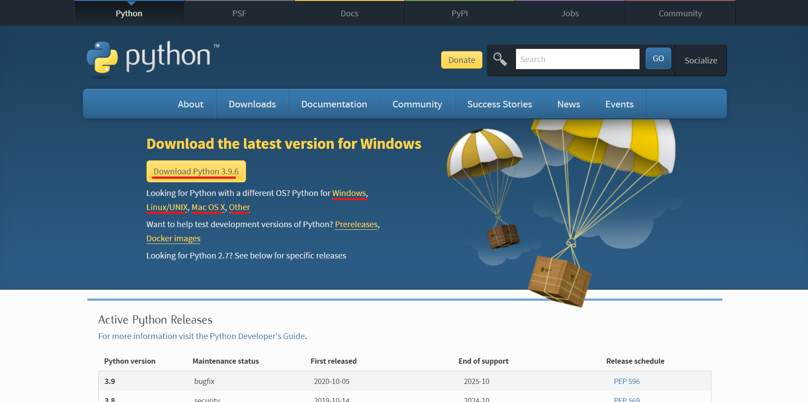

1. 파이썬 공식 홈페이지에서 현재 운영체제에 맞게 파이썬을 설치 파일을 다운받고 실행한다.

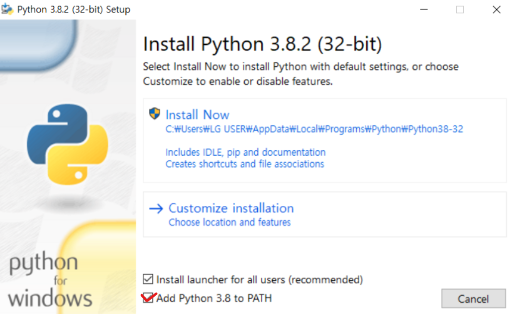

2. 설치 파일을 실행하면 나오는 창에서 하단의 **체크박스를 꼭 체크하둔다**. (제일 하단의 체크박스는 프로그램의 실행 경로에 파이썬을 추가한다는 의미)

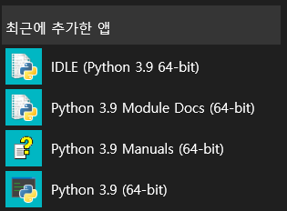

3. 설치를 완료하면 최근 추가된 앱 목록에 파이썬 프로그램을 확인 할 수 있다.


## 파이썬 인터렉티브 셸


- 파이썬 인터렉티브 셸 : 파이썬 명령어를 한 줄씩 입력하여 실행과 결과를 볼 수 있는 공간

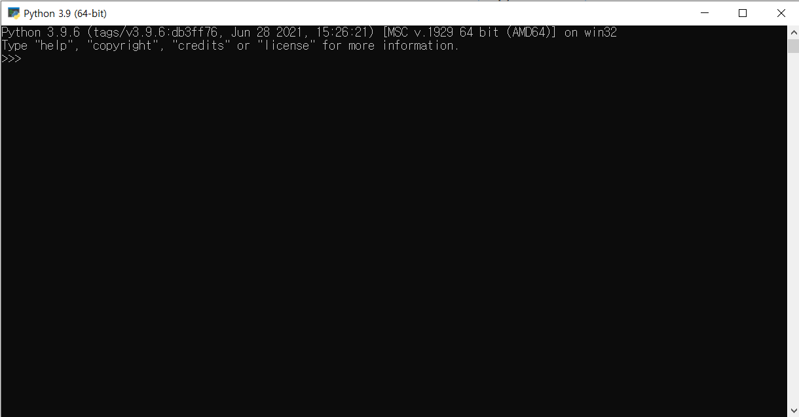

## 파이썬 IDLE 에디터


- 긴 코드를 입력하거나 코드를 저장해야할때 사용.

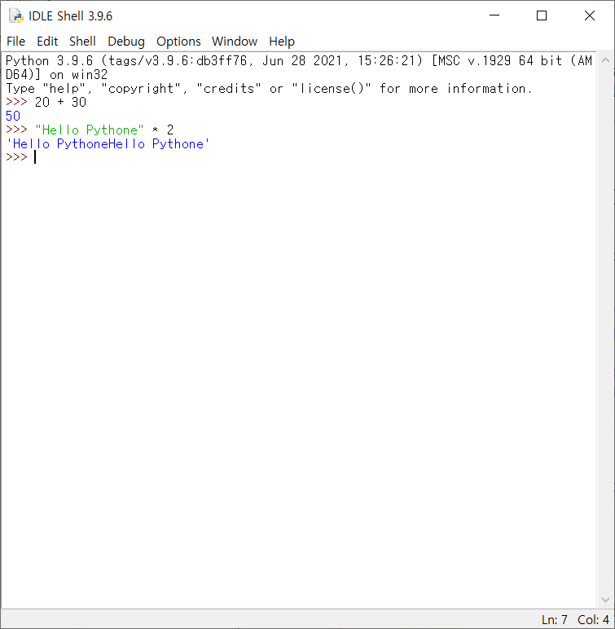

- 새로운 파일 생성

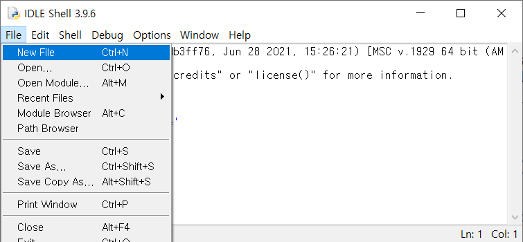

- 예제 코드 작성

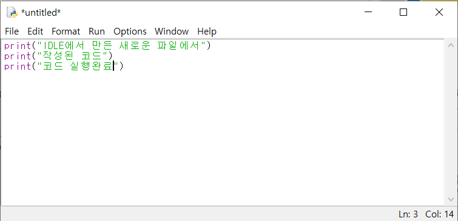

- 작성한 코드 저장 후 실행(`Run -> Run Module`)

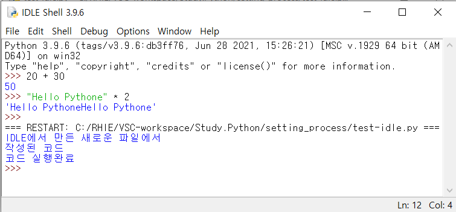

### 개발 전용 폰트 설정

IDLE 에디터를 사용해보니 폰트의 문제점이 많이 보였다. 예를 들어서 숫자`'1'`, 알파벳 L의 소문자 `'l'`과 구분자 `'|'`은 정말 구분하기 힘들었다. 알파벳 대문자 `O` 그리고 소문자 `'o'`, 숫자 `'0'` 도 마찬가지다.

그래서 IDLE을 사용시 개발 전용 폰트 설정을 하기를 권장한다. (하지만 나는 VS CODE 나 파이참을 사용할 것이기 때문에 넘어가겠다.)

- D2Coding : [https://github.com/naver/d2codingfont](https://github.com/naver/d2codingfont)
- 나눔고딕 코딩 글꼴 : [https://github.com/naver/nanumfont](https://github.com/naver/nanumfont)

## 비주얼 스튜디오 코드

- 파이썬 확장자 설치하기

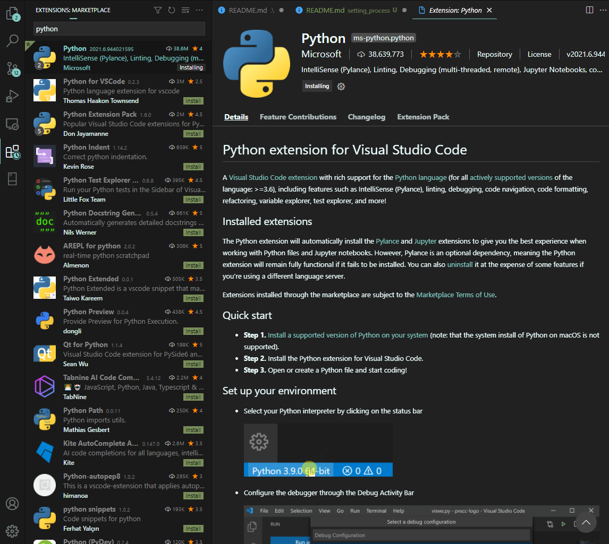

- Git Bash로 파이썬 실행

```bash
# 해당 경로로 접근한 다음
$ python [파일명].py
```

- IDLE에서 만든 파이썬 파일 Git Bash로 실행 결과

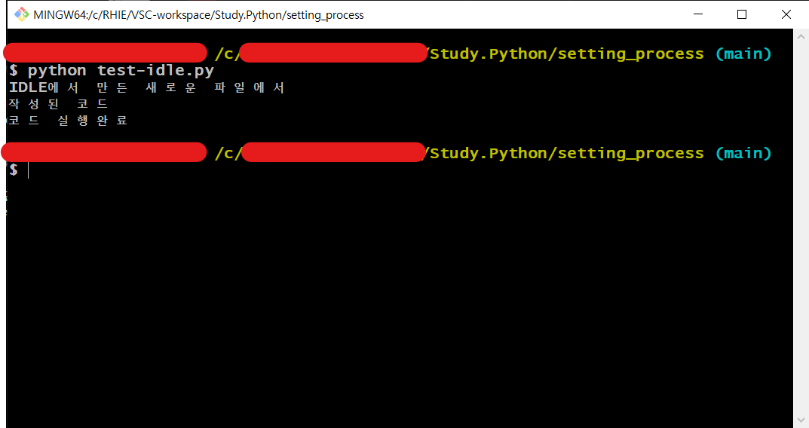

## Git-Bash Terminal gets Error of Python

### `Permission Denied`

- Bash에서 `$ python --version` 커맨드를 실행했는데 `Permission Denied`가 발생했다.
- 이를 해결하기 위해서는 윈도우 설정에 `앱 실행 별칭`으로 가서 다음과 같이 해당 앱 설치 관리자를 `"끔"`으로 표시해준다.

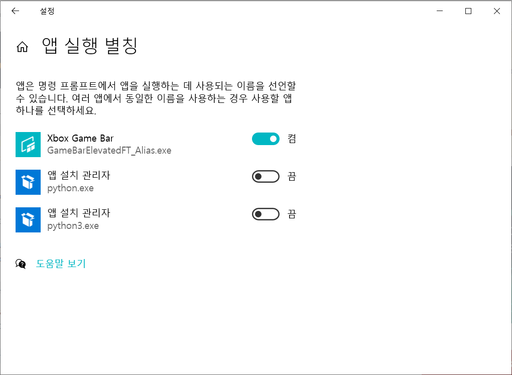

- https://stackoverflow.com/questions/56974927/permission-denied-trying-to-run-python-on-windows-10